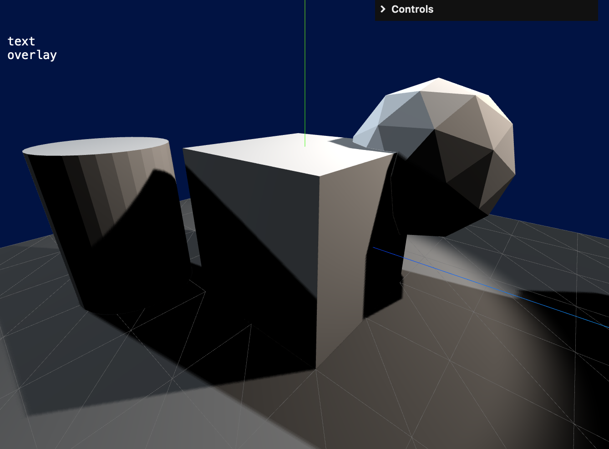

# ThreeJSdemo

 **Three.js Demo with Object Manipulation and Shadows**

Exercising a variety of interesting packaged features in ThreeJS:

* built-in geometries
* camera control
* object picking with raycasting
* object manipulation gizmos
* shadow-casting light sources
* light source helpers


## *Boilerplate Source*

Starting with Sean Bradley's patch to coerce ThreeJS into using ES Modules:

```
https://github.com/Sean-Bradley/Threejs-Boilerplate
```

NOTE: coming straight out of git, there is an immediate warning in the JavaScript Console, though this has no apparent effect:

```
TypeError: Module specifier, 'three' does not start with "/", "./", or "../".
Referenced from http://127.0.0.1:3000/client.js
```

## *Demo Package*

This package consists of 3 source files which should be dumped directly into a pre-installed Threejs-Boilerplate setup:

```
./public/index.html
./public/client.js
./server.js
```

Use the server.js file in place of the existing app.js to start node, and enter the provided localhost URL in your browser:

```
> node server.js
 ┌───────────────────────────────────┐
 │                                   │
 │   Express Server:                 │
 │                                   │
 │       http://localhost:8080       │
 │                                   │
 └───────────────────────────────────┘
```




## *Instructions*

Clicking on an object will activate it's transformation gizmo.

Keyboard keys T, R, and S will switch between translate, rotate, and scale.

The W key will toggle between the object's world and local coordinate systems.

Clicking on the background will disable the gizmo and activate the camera's controller.

